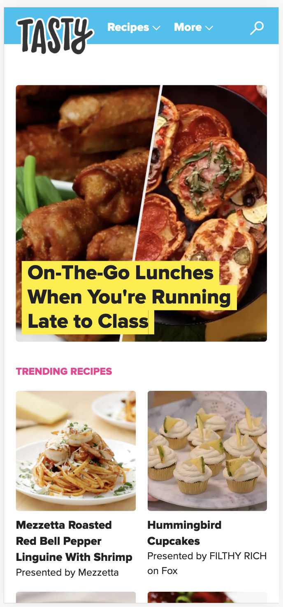
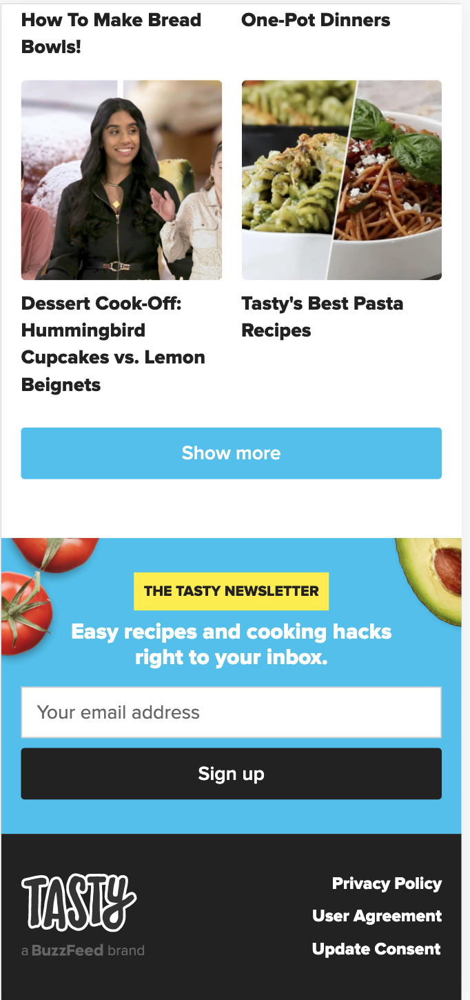

# herkansing

Auteur: Jackie Leune

link: http://127.0.0.1:53908/index.html

Mijn startniveu is blauw.
Mijn focus ligt voorlopig op de opmaak.

Idee:
Ik ga de website Tasty.co namaken. 

Voorbeeldfoto's:

Procesverslag

Week 1:
- Eerste opzet van website gemaakt
- Header gemaakt en opgemaakt 

Week 2:
- Github volgorde verbeterd
- Extra pagina + content toegevoegd aan de website
- Lettertype gezocht en toegepast

Week 3:
- Met flexbox gewerk
- Microinteractie erin gezet

Voortgang gesprek planning
- Flexbox; blokken naast elkaar zetten
- Pannenkoeken menu; als er op de website een is, mag je die dan namaken of moet je een andere oplossing bedenken?
- Java; 360 turn
- let keyword javascript

Week 4:
- Compleet opnieuw begonnen
